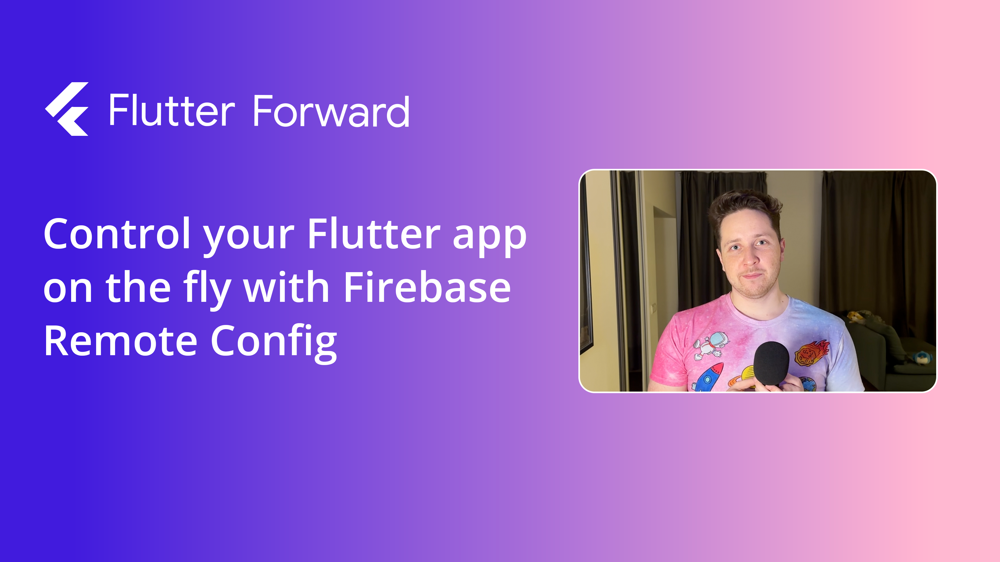

# Flutter Firebase Remote Config demo app



A Flutter Forward agenda app that covers multiple Firebase Remote Config features:

1. Parameters;
2. Conditions;
3. Feature flags and staged rollouts;
4. A/B testing.

Check the video tutorial on [YouTube](https://youtu.be/l_-eAINdz90).

## Building

You can follow these instructions to build the app and install it onto your device.

### Prerequisites

If you are new to Flutter, please first follow the [Flutter Setup](https://flutter.dev/setup/) guide.

### Building and installing the app

The easiest way to get started is by cloning the repository and following the video tutorial on [YouTube](https://youtu.be/l_-eAINdz90).

Create a new Firebase project and import the Firebase Remote Config configuration file `remote_config.json` from the `backup` directory.

Then, connect the Firebase project to the Flutter app by running the following command (replace `<project_id>` with your Firebase project ID):

```
flutterfire configure -p <project_id> -o lib/features/firebase/firebase_options.dart
```

Finally, run the following commands to build and install the app:

```
flutter pub get
flutter pub run build_runner build
flutter run
```
